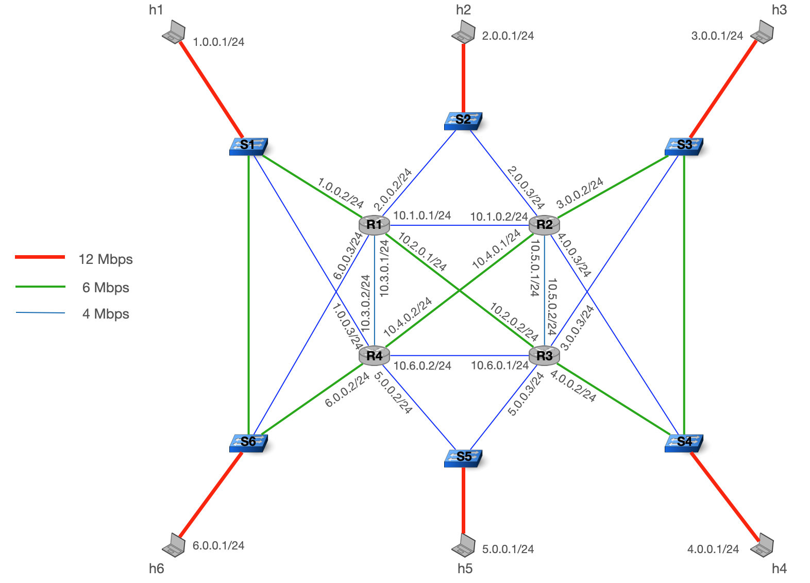

# AdvNet2020 Project

> We may release some updates/bug fixes to the infrastructure files during the project.  
> If we do, the only thing you will have to do is run the following command in the repository in your VM:

```bash
git pull https://gitlab.ethz.ch/nsg/public/adv-net-2020-project.git master
```

During this year's project, you and your group are responsible for configuring the network shown below.
Your primary objective is to deliver as much traffic (i.e., maximize the number of successfully delivered packets) as possible for different traffic patterns and failures.

As for the exercises, we provide each group of students with a VM where everything is pre-installed already. 
This time, your VM has more CPUs, memory and hard drive to ensure better performance when testing the network.
To access your VM, you can follow the [guidelines](https://gitlab.ethz.ch/nsg/public/adv-net-2020#access-your-own-vm) that we wrote for the exercises. The login info for your group's VM are in `login_XX.txt`

To get started with the project, log into your VM and clone this repository **in a directory called `/infrastructure` in `/home`**. This is done with the following command
```bash
cd ~
git clone <THIS-REPO> infrastructure
```


### Table of contents

- [Overview](#overview)
- [Configuring the network](#configuring-the-network)
- [Building the topology and running scenarios](#building-the-topology-and-running-scenarios)
- [Frequently asked questions (FAQ)](#frequently-asked-questions-faq)


## Overview

Below, we give you the key points about the provided topology and your task: successfully delivering as much traffic as possible for different traffic and failure scenarios.




### Topology

-   We provide you with the topology shown above consisting of hosts, P4 switches, and FRR routers.
    All interfaces and addresses are pre-configured and you already have basic connectivity in your network.
    That is, each host can reach any other host, which you can verify using `ping` or similar.

- The links between hosts, switches, and routers have different capacities, as shown in the figure.

-   There are six hosts (`h1` -- `h6`) connected to your network.
    Traffic will be sent/received by these hosts, but you have otherwise no control over them, i.e. you will *not* configure the hosts.

-   Each host is connected to a P4 switch (`S1` -- `S6`) at the edge of your network, which you can program during this challenge.
    All P4 switches are managed by a central controller (not shown), which you can also program.
    The switches and controller we provide you are already capable of L2 forwarding to ensure connectivity in your network.
    In addition to modifying the P4 program of each switch, you also have access to the Linux nodes the switches are running on, which allows you to run commands such as `tc`.

-   In the core of your network are four routers running [FRR][frr].
    The interfaces as well as OSPF are already configured to ensure connectivity. The OSPF weight of each link is initialized to 10.
    Similar to switches, you can both configure FRR and the underlying Linux node.

[frr]: http://docs.frrouting.org/en/latest/


### Task

During this project, the hosts exchange UDP traffic according to [traffic scenarios](#traffic-scenarios).
Your task is to deliver as much of this traffic as possible.
Three main factors will make your life difficult:

- The volume of exchanged traffic will often exceed the capacity of the shortest paths in the network (in its initial configuration).
- You only have limited setup time before traffic starts.
- While traffic is exchanged, links will fail randomly according to [failure scenarios](#failure-scenarios).

The traffic and failure scenarios are defined in the `scenarios` directory.
They are [CSV files][csv] with the respective file endings `.traffic` for traffic scenarios and `.failure` for failure scenarios.
We will explain them in detail below.
Feel free to add your own scenarios if you want to experiment!

> In each traffic scenario file, the first line indicates what each column is used for. With that information, you can build your own custom scenarios and further test your solution.

[csv]: https://en.wikipedia.org/wiki/Comma-separated_values

In general, each scenario lasts one minute.
Your router configuration and controller will be started at the same time as the scenario.
To give your network time to stabilize (e.g. to exchange messages or install table rules), traffic and failures will only begin a few seconds after the start of the scenario.

#### Traffic scenarios

The `default.traffic` scenario is defined as follows:

- Hosts exchange UDP traffic. We use the term *flow* to describe UDP traffic from one host to another.

- Hosts can be both senders and destinations of flows at the same time.

-   Flows begin 5 seconds after the scenario starts (`t=5`), and end after 50 seconds (`t=55`).
    The receivers listen 5 more seconds for remaining traffic. Anything arriving after one minute (`t=60`) is considered *lost*.

-   Flows belong to different classes: gold, silver, and bronze.
    Intuitively, gold traffic matters most, followed by silver, then bronze.
    Hosts will indicate the class of their traffic using the `TOS` field in the IP header: 128 for gold, 64 for silver, 32 for bronze.

There are other traffic scenarios to test your configuration.
They do not necessarily follow the specification above, but might be helpful to test your configuration.

- `default-*`: different node combinations.
- `hard`: Each class sends at 12 Mbps.
- `two-flows`: Each host sends two flows instead of one.
- `circle`: `H1` sends to `H2`, `H2` to `H3`, ..., and `H6` to `H1`.
-   `incast`: `H1` does not send traffic, all other hosts send traffic to `H1`.
    There is 1 gold, 2 silver, and 2 bronze flows in this scenario.

    

#### Failure scenarios

The `default.failure` scenario is defined as follows:

- After 10 seconds (`t=10`), links will fail pseudo-randomly.

- Each failure starts at a random time between `t=10` and `t=35`, and lasts 10 seconds.

- Failures will never partition the network, i.e. your network will always stay connected. In particular, this means links between hosts and switches never fail.

- Multiple failures may occur at the same time, but there will never be more than three failures at the same time.


There are other failure scenarios to test your configuration.
They do not necessarily follow the specification above, but might be helpful to test your configuration.

- `default-*`: same rules, but different random seeds for other failures.
- `hard`: Up to 8 failures at the same time.
- `persistent-*`: Fail 1, 2, or 3 links from `t=5` up to `t=50`, i.e. no links go up and down except at the start and end of the experiment.

> Like with traffic scenarios, feel free to build your own failure scenarios!

#### Performance Evaluation

To evaluate the performance of your solution, we use the following process.

-  For each flow, we measure the *packet reception ratio* (PRR), the fraction of correctly received packets.

-   The combined score is the weighted average of all PRRs.
    Gold traffic will account for `10/15` of the combined score, silver traffic for `4/15`, and bronze traffic for `1/15` (regardless of the number of flows per class).
    Consequently, your combined score will be between `0` (nothing arrived) and `1` (everything arrived).

Keep in mind that having a high score with one scenario does not mean that your solution performs well in general.

> With scenarios that do not follow the `default` specification (e.g. `incast`), it might not be possible to reach a score of 1 because the network simply does not provide sufficient bandwidth.

#### Leaderboard

We provide a leaderboard where you can compare your solution against the other groups. To assess the performance of your solution, 
we run it on our server and on traffic and failure scenarios that we keep private. We now give more detail on how we compute your score on the leaderboard. 

- We test your solution on multiple scenarios, and for each scenario we do multiple runs.

- For each scenario, there is always exactly 6 flows in total.

- We always use *at least* one flow of each class (Gold, Silver and Bronze).

- Each scenario lasts 1 minute.

- Each scenario is run both *with* and *without* failures, and your network should perform well in both cases.
    

- Finally, we assess your solution using the *[packet reception ratio](#performance-evaluation)*. 
  The final score will be the *minimum* of the scores obtained with and without failures.

> We recommend you to follow the `default` specification presented above to create custom scenarios similar to our evaluation, however you are free to use more flows or shorter/longer scenarios if you would like to.


## Configuring the network

Your complete network configuration should go into the `configuration` directory.
You will find sub-directories for routers, switches, and a controller.
Here, we explain the purpose of each file, and in the [next section](#building-the-topology-and-running-scenarios) we introduce the commands to apply the configuration.

Some files already contain an initial configuration to ensure that your network is connected.
You are free to change any existing configuration (unless you are explicitly told not to change it).
However, *do not* rename or move the provided files.


### Routers

You are already familiar with the router configuration scripts from the MPLS and Multicast exercises.
In `configuration/routers`, you will find a configuration script for each router.
The commands in this script will be executed in a terminal on the corresponding router node.

The most important command is `vtysh`, the virtual terminal used to configure FRR.
Any lines you add here will be sent to the `vtysh` as if you were entering them one by one.

However, keep in mind that you can add additional commands before/after the `vtysh` command!
Any command that works in the router terminal can be used, for example `tc`.
Your `configuration/routers/R1.sh` could look like this:

```
vtysh << EOM
(...)
EOM

echo "Configuring tc."
tc (some command)
```


### Switches

Similar to routers, you will find `S*.sh` scripts corresponding to each switch in `configuration/p4switches`.
Other than routers, the switches do not have a `vtysh`, but you can still use other commands, if you need.

In this folder, you can also find the P4 program `switch.p4`, which will be installed on all switches.
The default program is already capable of L2 forwarding.

> While all switches share the same program, their functionality can differ greatly, depending on which rules are installed on each switch, which register values are set, etc.

Finally, there is a `S*-commands.txt` file corresponding to each switch, which you may use for static P4 commands (if any).


### Controller

Finally, there is a central controller that is connected to all P4 switches.
This controller is implemented in Python 2 in `configuration/controller.py`.

> We cannot (yet) use Python 3 because of some dependencies that do not support it.
> Make sure that your controller works with Python 2.

The controller is started with the selected traffic scenario and automatically parses the CSV file for you.
The controller variable `traffic` contains a list of dictionaries.
Each dict contains the information of one flow, such as `src`, `dst`, etc.

The provided controller already installs the required rules for L2 forwarding onto the switches.

:no_entry: The controller may only interact with the P4 switches, and nothing else. Aside from the (already provided) traffic scenario, the controller must not attempt to read any traffic or failure files, nor run any commands interacting with the infrastructure, in particular no `docker` or `ovs-ofctl` commands.

Finally, you may find yourself in need of some additional dependencies.
If anything has to be installed, be sure to add this requirement to `configuration/requirements.txt`. ([What are requirement files?][reqfiles])
Only requirements from [PyPI][pypi] are allowed, i.e. requirements that you can install "normally" via `pip install <req>`.

> Pip is a powerful tool that is capable of installing requirements from github and other sources, but you *must not* do this for this project.
> We will not install any requirement that does not come from PyPI, and using them may result in your controller not working.

[reqfiles]: https://pip.pypa.io/en/latest/user_guide/#requirements-files
[pypi]: https://pypi.org


## Building the topology and running scenarios

To make operating the network with routers, switches, and a controller as easy as possible, we have prepared the script `cli.sh` for you.
With this command line interface (CLI), you can run the whole project pipeline from build to traffic generation; start individual steps of the pipeline; as well as access nodes to try out commands.

```
Usage: cli.sh [FLAGS] COMMAND [ARGS...]

Main commands:
run-pipeline [t] [f]        Run everything from build over config to scenario.
run-pipeline-dry [t]        Run everything *except* traffic or failures.
list-scenarios              Show all available traffic and failure scenarios.
access [node] [cmd...]      Access node. If no cmd is given, open default shell.
monitor                     Print the bit rate of each link in real time.

Commands to run individual steps of the pipeline:
build                       Build the project topology.
cleanup                     Cleans the project topology.
install-requirements        Install python requirements.
configure-nodes             Send configuration commands to router and switch nodes.
start-switches              Compile the p4 programs and start all switches.
run-controller [t]          Run the controller.
run-scenario [t] [f]        Generate traffic and failures.

Additional management commands:
stop-switches               Stop all p4 switches.
reboot-switches             Reboot all p4 switches.

Arguments:
[t]             Traffic scenario name. See list-scenarios.
[f]             Failure scenario name. See list-scenarios.
[node]          Node name, e.g. H1, S1 or R1. Capitalization does not matter.
[cmd...]        Any command(s) and arguments.

Flags:
--no-opt        Do *not* use optimized p4 switches (build).
--pcap          Enable pcap for non-optimized p4 switches (start-switches).
--debug-conf    Configure nodes sequentially, printing output (configure-nodes).
```

### CLI flags

There are some flags that allow you to change the behavior of `./cli.sh`, mostly intended to make debugging easier.
The flags are accepted by both individual commands and `run-pipeline`.
Make sure to put all flags *before* the command, like this:

```
./cli.sh --no-opt --pcap run-pipeline
./cli.sh --no-opt --pcap start-switches
```

> Commands ignore flags that are irrelevant for them, e.g. `start-switches` would ignore `--no-opt`, which is a `build` flag.

See the respective commands below for a detailed explanation of each flag.


### `./cli.sh run-pipeline [t] [f]` and `./cli.sh run-pipeline-dry [t]`

This command runs everything.
It is also the command that we will use to evaluate your configuration, so it's your best option to check whether everything works.

You can either run it *without* any arguments, or provide the names of both traffic (`t`) and failure (`f`) scenario to run.
When providing scenarios, use the scenario name (without directory or file ending).
For example, `./cli.sh run-pipeline example1 example2` will use the traffic scenario `scenarios/example1.traffic` and the failure scenario `scenarios/example2.failure` (They do not exist, the names are just chosen for illustration).
You can combine each traffic scenario with any failure scenario.
If you do not provide any arguments, `default.traffic` and `default.failure` are used.

You may be wondering about the timeline of events during the pipeline.
Concretely, the following happens first:

1. The network is built (`./cli.sh build`).
2. Requirements are installed (`./cli.sh install-requirements`).
3. The P4 programs are compiled and the P4 switches are started, along with static rules (`./cli.sh start-switches`).
4. Configuration scripts are executed (`./cli.sh configure-nodes`).

> The first time you build the network it will take few minutes because the script pulls several docker images, after it should be faster.

Right after the configuration commands have been sent, the following happens *at the same time*:

- Traffic and failure generation is started (`./cli.sh run-scenario`).
- The controller for P4 switches is started (`./cli.sh run-controller`).

As described above, traffic and failures will not begin immediately, so your routers and controller will have a few seconds to converge to their final state.

> If you want to run the individual steps manually, it's a good idea to stick to this general order of commands.
> Running the commands individually gives you more flexibility, e.g. you can recompile your P4 programs without rebuilding the whole topology.

During development, you might often need to start the whole setup, but without actually starting any scenarios, such that you can experiment yourself.
To faciliate this, you can run `./cli.sh run-pipeline-dry`, which does exactly this:
Run everything, *except* traffic or failures.
You can still provide the name of a traffic scenario, which is passed to your controller.


### `./cli.sh list-scenarios`

If you are unsure which scenarios are available, use this command.

```bash
$ ./cli.sh list-scenarios
Traffic scenarios:
circle
default-2
default-3
default
hard
none
two-flows

Failure scenarios:
default-2
default-3
default
hard
none
persistent-1
persistent-2
persistent-3
```

> The `none` scenarios simply do nothing, and you can use them to test traffic without failures, etc.


### `./cli.sh access [node] [cmds...]`

Similar to the `./access.sh` script from previous exercises, this command allows you to open a terminal or run commands on each node in the network.

> Be careful! This command is only intended for *trying out* stuff. If you want anything to be considered during evaluation, you *must* put it in one of the configuration files (see [Configuring the network](#configuring-the-network) above)!

To open a terminal, just provide the node name without any parameters, e.g. `./cli.sh access H1` for host 1 or `./cli.sh access R1` for router 1.
By default, this will open `bash` for hosts and switches, and the FRR `vtysh` for routers.
You can also open a shell explicitly, e.g. `./cli.sh R1 bash` opens `bash` instead of `vtysh` on router R1.

The same syntax can also be used to directly run a command, which is particularly useful for `tcpdump`:

```
$ ./cli.sh access h1 tcpdump -ni S1switch
tcpdump: verbose output suppressed, use -v or -vv for full protocol decode
listening on S1switch, link-type EN10MB (Ethernet), capture size 262144 bytes
```

Remember that you can also run e.g. `./cli.sh access h1 ifconfig` to check interface names.

> Capitalization does not matter, Both `H1` and `h1`, etc., are accepted.


### `./cli.sh monitor`

With multiple flows and failures, it can be cumbersome to track whats going on.
We have prepared a monitoring command that displays the current link load for all links in real-time.

The command displays the bit rate for both directions of a link. The bit rate from the left to the right of a link is the value on the left between parentheses whereas the bit rate from the right to the left of the link is the value on the right. If a link is strictly vertical, the bit rate for the direction top-bottom is on the left and the bit rate for the direction bottom-left is on the right. 

> Make sure your terminal is high and wide enough to fit the whole display!


### `./cli.sh build` and `./cli.sh cleanup`

Use `./cli.sh build` and `./cli.sh cleanup` to build and tear down all containers.

By default, we use an optimized p4 image that allows high throughput.
The `--no-opt` flag uses a non-optimized image instead that logs more events for easier debugging.
Also, if you want to use the `--pcap` flag, you *must* use `--no-opt`.

After building, you can verify that the containers are up using `sudo docker ps`. You should see a container for every node in the network.

```
$ sudo docker ps
CONTAINER ID        IMAGE               COMMAND                  CREATED             STATUS              PORTS               NAMES
2ab1000cecd8        thomahol/d_host     "/usr/sbin/docker-st…"   8 minutes ago       Up 8 minutes                            1_S6host
134565454cde        thomahol/d_p4_opt       "/usr/sbin/docker-st…"   8 minutes ago       Up 8 minutes                            1_S6router
                          1_S5host
(...)
```

> If you use the `--no-opt` flag, you will see the ` thomahol/d_p4` image instead.


### `./cli.sh configure-nodes`

Executes all `.sh` scripts in the `configuration/` directory on the respective nodes.

By default, all nodes are configured in parallel, to avoid situations where one node blocks another.
Also, all output is hidden by default, as lines from any configuration would show up intermingled and hard to match to a specific node.
As this can make debugging difficult, you can provide the `--conf-debug` flag.
This flag forced the nodes to be configured one after another, and displays all output.


### `./cli.sh start-switches`, `stop-switches`, and `reboot-switches`

`./cli.sh start-switches` both *compiles* the P4 program in `configuration/` and starts all P4 switches with it.
Use this command if you want to recompile your P4 program and start switches with the new program.
The stop and reboot commands *do not* recompile the P4 program.

When you have built non-optimized p4 switches using `--no-opt`, you may use the `--pcap` flag when starting switches to collect all traffic.
You can find the pcap files in `~/infrastructure/shared/S*/pcap/`.

> Especially the pcap files can take up a lot of disk space!
> If you run out of space, make sure to clean your pcaps and logs.

### `./cli.sh install-requirements`

Installs all controller requirements in `configuration/requirements.txt`.


### `./cli.sh run-controller [t]`

Starts the controller in `configuration/controller.py`.
The chosen traffic scenario (`[t]`) is sent to the controller as well.
If you do not specify a traffic scenario, the `default` scenario is used.

> When you run the commands manually and rely on the traffic scenario in your controller, make sure to pass the correct scenario to the controller!
> `run-pipeline` automatically takes care of this.


### `./cli.sh run-scenario [t] [f]`

Runs traffic and failure scenarios. The arguments are the same as for `run-pipeline`.

## Frequently Asked Questions (FAQ)

**Which links can fail in the network?**

All the links but the ones between the switches and the hosts. 

**Are we allowed to use `ovs-vsctl` to check if a link is up or down?**

No. We give more detail in this [section](#controller) of the README.

**Are we allowed to configure the hosts?**

No. And if you do so, your host configuration will not be used when we will run your solution on our server. You can only configure your network via the configuration files available in the `configuration` directory. 

**Does the packet reception rate (PRR) take into account reordering?**

No, it does not. 

**The controller returns an error when I want to use P4 digests.**

This is because the optimized switch is compiled with the digest capability disabled. 
Fortunately, you can still use `copy_to_cpu` to send message from the data plane to the control plane. We show how to use `copy_to_cpu` in this [example](https://github.com/nsg-ethz/p4-learning/tree/master/examples/copy_to_cpu). 

**Can you install iperf on the hosts?**

You should use `iperf3` instead of `iperf`, it is installed on all the hosts as well as the routers and switches. 

**A ping with TOS set to 128 (`ping -Q 128 1.0.0.2`) returns an error.**

You can use `ping -Q 0x80`, this should work just fine. 

**I can't reach the expected bandwidth with `iperf3` and UDP traffic.**

This is the expected behavior. The problem with `iperf3` is that it sends sequences of bursts of UDP packets, instead of sending UDP packets constantly. Because of that, the queues used in the devices will quickly become full upon a burst of UDP packets, and many packets will then be dropped. 
If you want to measure the available bandwidth with UDP traffic, we provide the `udp.py` script that is available on every host in the `/home` directory.
You can start a UDP flow sending 4Mbps during 5sec with the following command.

```
python3 -i udp.py
>>> send_udp_flow("2.0.0.1", rate="4M", duration=5, packet_size=1500, batch_size=1)
```

Here, the packets will have a size of 1500 bytes, and will be sent one by one (batch_size=1). 
If you want to see how many packets arrived, you can run the following command on the destination node, where the first parameter is the source IP and the second parameter is the destination port. 

```
python3 -i udp.py
>>> recv_udp_flow("1.0.0.1", 5001)
```

Then with `ctrl+c` you can see the number of received packets. 

**Iperf3 does not set the TOS field correctly.**

`iperf3` can only use TOS values that are multiple of 4 (with the option `-S` or `--tos`). If you want to use a TOS value that is not multiple of 4, you can use the `udp.py` script that we provide with the `tos` option on the sender side. For instance if you want to use a TOS of 27:

```
python3 -i udp.py
>>> send_udp_flow("2.0.0.1", rate="4M", duration=5, packet_size=1500, batch_size=1, tos=27)
```


**How can I configure feature X from the lecture in FRRouting?**

FRRouting does not support everything you have seen during the lecture, or some features that you have seen in configuration examples for real routers. Check the [FRRouting Documentation](http://docs.frrouting.org/en/latest/index.html) to see which features are available. To safe yourselves some time searching, we collect known limitations below:
OSPF does not support LFAs (loop-free alternates).
